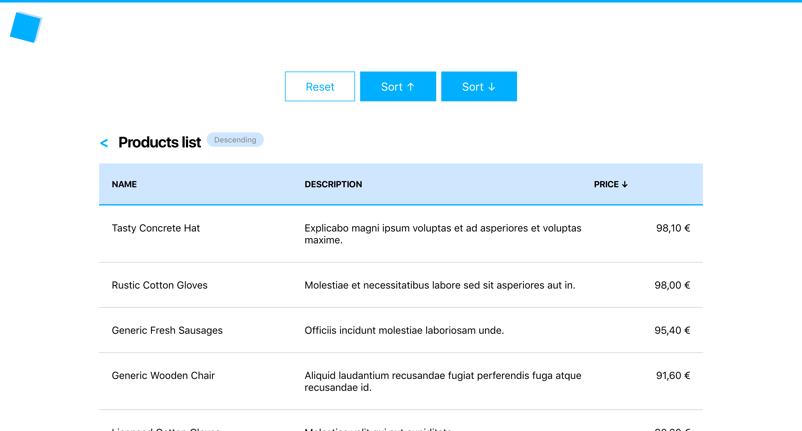

# Products list: location

Create two pages: home (`/`) and products (`/products`).

The home page should only display a greeting: `Welcome, visitor!` and a link to the producst page.

The products page should display a list of products. Find the list of products in the `data` folder.

On the products pages there are 3 buttons: reset, sort ascending, sort descending.

On click on the sort ascending button the URL should update to `http://localhost:3000/products?sort=asc` and the list of products should be ordered by price in ascending order (from lowest to highest).

On click on the sort descending button the URL should update to `http://localhost:3000/products?sort=dsc` and the list of products should be ordered by price in descending order (from highest to lowest).

In addition, there is a label next to the page title, that indicates the sorting order. Next to the price column label an arrow appears to indicate there is sorting order applied.

If the URL has no sorting related query params (`http://localhost:3000/products`), the products list should not be sorted in any way, they should be back to the initial order. Also, no label is displayed next to the page title, and no arrow is displayed next to the price column label.

Last there is a back button next to the page title that brings the user back to the home page.

Note: sorting should not be part of the history.
